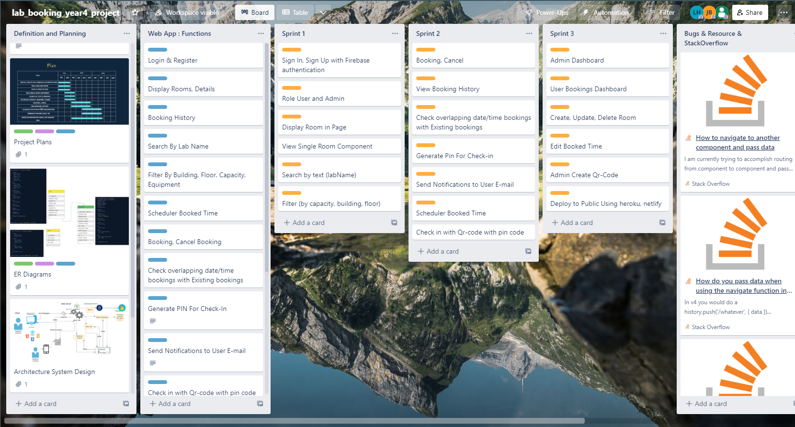
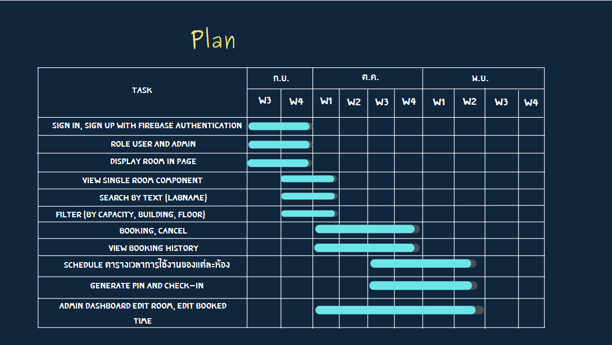
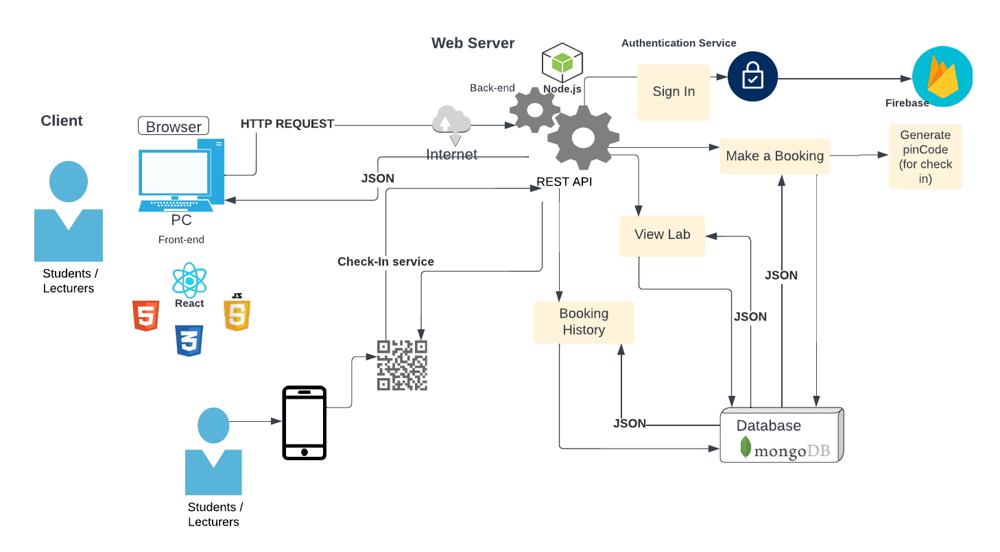
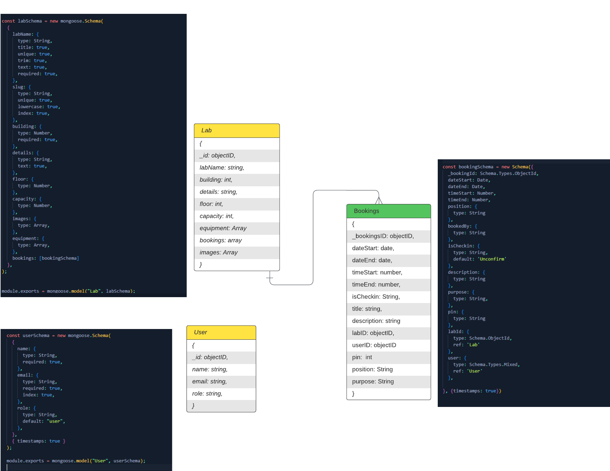

# LAB Booking System with Scan Check-In with QrCode

Lab Booking System in University of the thai chamber of commerce.
Web-Application Built with React.js Redux, Node.js Express, MongoDB, Firebase Authentication 
and Nodemailer.js for Send Notifications to Email and Admin System.


## Table Of Contents

*  [Getting started](#getting-started)

*  [View Live Demo](#view-live-demo)

*  [Installation](#installation)

*  [About project](#about-project)

*  [Project Proposal](#project-proposal)

*  [Trello Board](#trello-board)

*  [Solution](#solution)

*  [Planning](#planning)

 *  [Architecture System Design](#architecture-system-design)

 *  [Use Case Diagram](#use-case-diagram)

*  [Entity Relationship Diagram](#er-diagram)

*  [Design](#design)

*  [Technologies](#technologies)

*  [Challenges and final thoughts](#challenges-and-final-thoughts)

*  [Future Developments](#future-developments)

*  [Team](#team)

## Getting Started

These instructions will get you a copy of the project up and running on your local machine for development purposes.

## View Live Demo 
 https://vbi-utcc-lab.netlify.app


### Back-end:

- MongoDB

- Express

- Node.js

```json
 "dependencies":  {
"body-parser":  "^1.20.0",
"cloudinary":  "^1.32.0",
"cors":  "^2.8.5",
"dotenv":  "^16.0.2",
"express":  "^4.18.1",
"express-jwt":  "^7.7.5",
"firebase-admin":  "^11.0.1",
"jsonwebtoken":  "^8.5.1",
"moment":  "^2.29.4",
"moment-timezone":  "^0.5.38",
"mongoose":  "^6.5.4",
"morgan":  "^1.10.0",
"nodemailer":  "^6.8.0",
"nodemon":  "^2.0.19",
"slugify":  "^1.6.5",
}
```


### Front-end
- React.js
- Redux

```่json
"dependencies":  {
"@aldabil/react-scheduler":  "^2.5.2",
"@ant-design/icons":  "^4.7.0",
"@devexpress/dx-react-core":  "^3.0.6",
"@devexpress/dx-react-scheduler":  "^3.0.6",
"@devexpress/dx-react-scheduler-material-ui":  "3.0.4",
"@emotion/react":  "^11.4.1",
"@emotion/styled":  "^11.3.0",
"@mui/icons-material":  "^5.0.4",
"@mui/lab":  "^5.0.0-alpha.51",
"@mui/material":  "^5.0.4",
"@mui/x-date-pickers":  "^5.0.0-alpha.7",
"@testing-library/jest-dom":  "^5.16.4",
"@testing-library/react":  "^13.3.0",
"@testing-library/user-event":  "^13.5.0",
"antd":  "^4.22.2",
"axios":  "^0.27.2",
"crypto-random-string":  "^5.0.0",
"firebase":  "^9.9.4",
"generate-pincode":  "^6.0.0",
"moment":  "^2.29.4",
"qr-code-styling":  "^1.6.0-rc.1",
"qrcode":  "^1.5.1",
"react":  "^18.2.0",
"react-bootstrap":  "^2.5.0",
"react-datetime":  "^3.1.1",
"react-dom":  "^18.2.0",
"react-icons":  "^4.4.0",
"react-image-file-resizer":  "^0.4.8",
"react-pin-input-hook":  "^1.0.8",
"react-redux":  "^8.0.2",
"react-responsive-carousel":  "^3.2.23",
"react-router-dom":  "^6.3.0",
"react-scripts":  "5.0.1",
"react-select":  "^5.6.0",
"react-toastify":  "^9.0.8",
"redux":  "^4.2.0",
"redux-devtools-extension":  "^2.13.9",
"redux-persist":  "^6.0.0",
"semantic-ui-css":  "^2.5.0",
"semantic-ui-react":  "^2.1.3",
"styled-components":  "^5.3.5",
"typewriter-effect":  "^2.19.0",
"web-vitals":  "^2.1.4"
}
```

### Authentication
- Firebase Authentication
### Database
- MongoDB

### File Image Upload API
- Cloudinary API
### Installation
- Clone the repo
`git clone https://github.com/liahoneyBP/lab_booking_year4.git`
- Change Directory to client and install package dependencies
`cd client`
`npm install --legacy-peer-deps`
- Change Directory to client and install package dependencies
`cd server`
`npm install`
- your .env file in  `client`, you have to config path url for firebase auth 
 for redirect sign-up complete and forgot password and your path api.
- For firebase authentication you need to register and create your project
  at https://firebase.google.com/ and Enabled Sign-in method likes Email/Password , Google and config SDK (in Project Setting > General > SDK setup and configuration) and add to server/config/
- your .env in server, you have to config mongodbURL, PORT and cloudinary api 
- For Cloudinary Api, create account and config your SDK likes name, key, secret 
 go to https://cloudinary.com/


 Open in your browser and navigate to [http://localhost:3000](http://localhost:3000/). You access the back-end on [http://localhost:8000](http://localhost:8000/).


### About project
- Graduation Project

### Project Proposal 
https://www.canva.com/design/DAFJ8krtxbs/bw89nLkokXWuH-0K89aMNA/edit
### Trello Board
https://trello.com/invite/b/wv8LaGC0/99f35b22a729f06b97d01473a68e1b19/labbookingyear4project
- 


#### Problem
Conventional lab room reservations such as how to record a reservation in a document or a user must book directly through the administrator. Causing many times to change the date and time may be inconvenient and may cause mistakes or booking duplicate and overlapping booking rooms.
or have made a reservation and haven't used it yet let various possibilities let others Lose the chance at that Lab.
#### Solution
The development of web -application Lab room reservations helps to reduce such errors as it allows administrators to view various booking information, and user can view information Schedule the availability of the room. via web application making it possible for anyone to check the lab usage schedule
Including the date and time of use and booking a lab by yourself
#### Planning
 
#### Architecture System Design

#### Use Case Diagram

#### ER Diagram 



### Design
- Figma
https://www.figma.com/file/adJZia1KLtQprGd8skvCHK/wireframe_%E0%B8%88%E0%B8%AD%E0%B8%87%E0%B9%81%E0%B8%A5%E0%B9%87%E0%B8%9A_high?node-id=0%3A1&t=JpTAJOsycJt8dcvb-1

### Technologies

- React.js
- Redux
- React Scheduler Library (DevExpress)
- Node.js
- MongoDB
- Mongoose
- Nodemailer.js
- QR-Code
- Deploy Heroku , Netlify

###  Challenges and final thoughts
- Work with date/time
- Prevent duplicate bookings for dates/times
- Work with Scheduler Library with bookings data
- Scan Check-In with Qr-Code
###  Future Developments
- Maximum book of user
- Dynamic add book scheduled class by admin
- Auto delete when booking is past
### Team
- [Jaranaswim](https://github.com/Jaranaswim)
- [Phatchanon022](https://github.com/liahoneyBP)
- [Tanawutsss](https://github.com/Tanawutsss)

> **Note:** The **Publish now**


